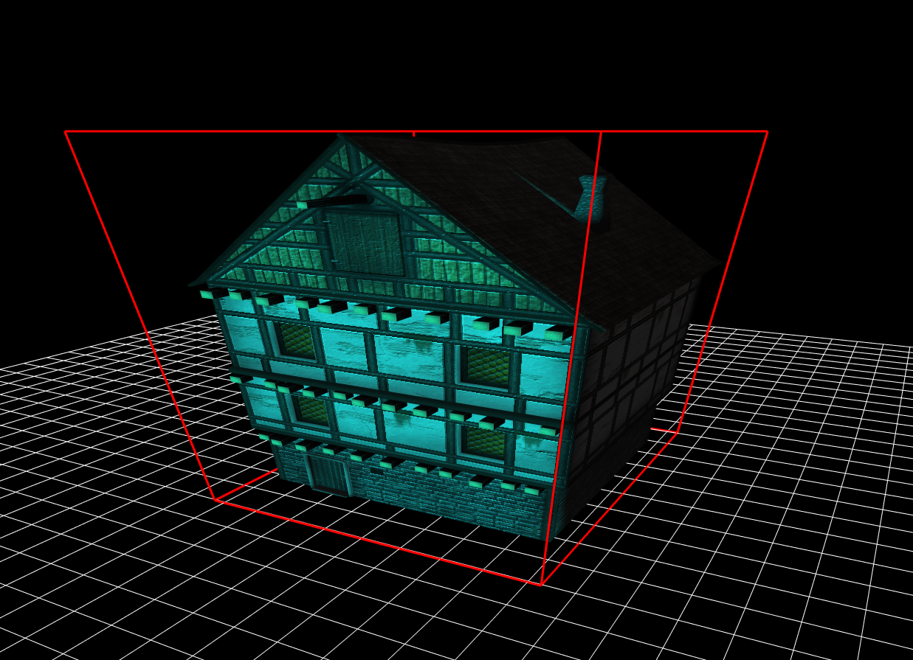

# Installation
```bash
git clone https://github.com/bkuolt/bgl-demo
cd bgl-demo
make install
make
```
# Run
```bash
    make run
```
or run `./demo <path-to-your model>` to view your custom models.

# Features
- Model loading and rendering
  - static meshes
  - support for **1** difuse map
-  Lighting
   - up to **5** directional lights
- Motion Blurring
- FSAA

# Controls

## Keyboard
| Key |  |
|-----|---|
| ESC | Terminate |

## Terminal
| Signal |  |
|-----|---|
| SIGINT | Terminate |
| SIGHUP | Terminate |

## Game Controller
**TODO**


# Tech Stack
## OpenGL 4.5 (GLSL 3.0)
 - Mesa3D
 - [GLEW](http://glew.sourceforge.net/)
 - [SDL 2.0](https://www.libsdl.org/download-2.0.php)

## Assets
 - [Assimp](http://www.assimp.org/)
 - [DevIL](http://openil.sourceforge.net/)
 - [SDL_image 2.0](https://www.libsdl.org/projects/SDL_image/)
 - [SDL_ttf] (https://www.libsdl.org/projects/SDL_ttf/)

 ## Utilities
   - [Boost.Timer](https://www.boost.org/doc/libs/1_72_0/libs/timer/doc/index.html)
   - [glm](https://glm.g-truc.net/0.9.9/index.html)