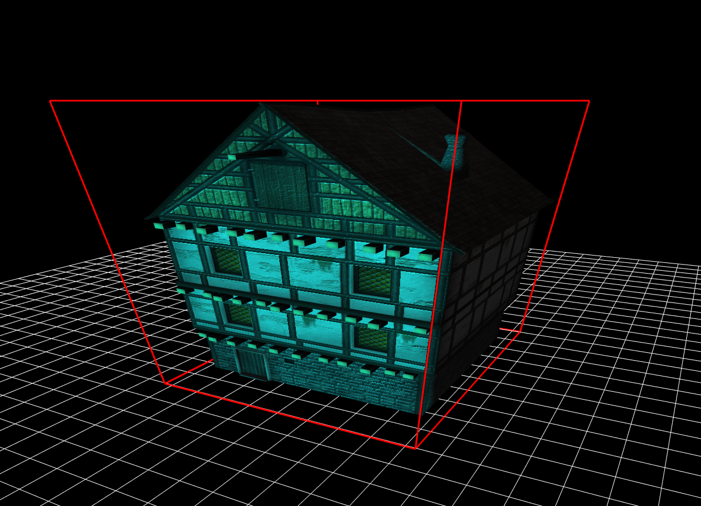

<<<<<<< HEAD
[](https://github.com/bkuolt/bgl-3D-model-viewer/actions/workflows/test.yml)
=======
[](https://github.com/bkuolt/bgl-3D-model-viewer/actions/workflows/test.yml)
>>>>>>> development



# Installation and Building
```bash
git clone https://github.com/bkuolt/bgl-demo
cd bgl-demo
./install.sh
cd src
make
``` 

# Run
```bash
    make run
```
or run `./demo <path-to-your model>` to view your custom models.

# Features
- Model loading and rendering
  - static meshes
  - support for **1** difuse map
-  Lighting
   - up to **5** directional lights
- Motion Blurring
- FSAA

# Controls

## Keyboard
| Key |  |
|-----|---|
| ESC | Terminate |
| SIGINT | Terminate |
| SIGHUP | Terminate |

# Tech Stack
 - OpenGL 4.5 (GLSL 3.0)
 - [GLEW](http://glew.sourceforge.net/)
 - [Qt 5]()
 - [Assimp](http://www.assimp.org/)
 - [glm](https://glm.g-truc.net/0.9.9/index.html) 